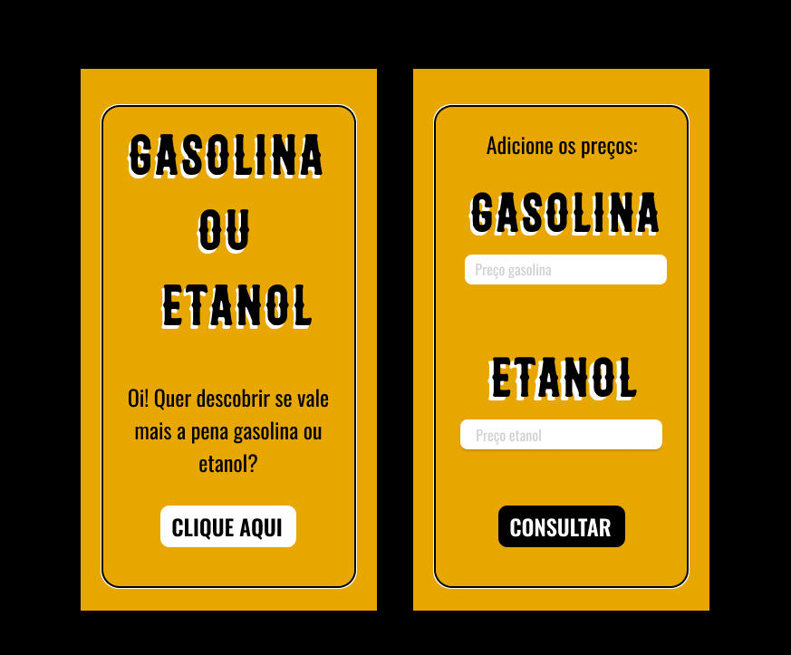

<h1 align="center"> Gasolina ou Etanol? </h1>

Projeto realizado durante o curso técnico de Desenvolvimento de Sistemas para a matéria de Programação de Aplicativos Mobile II no 3° módulo.   

  <a href="#-tecnologias">Tecnologias</a>&nbsp;&nbsp;&nbsp;|&nbsp;&nbsp;&nbsp;
  <a href="#-projeto">Projeto</a>&nbsp;&nbsp;&nbsp;|&nbsp;&nbsp;&nbsp;
  <a href="#-layout">Layout</a>&nbsp;&nbsp;&nbsp;|&nbsp;&nbsp;&nbsp;
  <a href="#memo-licença">Licença</a>

  

 

  

## 🚀 Tecnologias

Esse projeto foi desenvolvido com as seguintes tecnologias:

- React Native
- JavaScript
- CSS
- Git e Github
- Figma

## 💻 Projeto

O Gasolina ou Etanol é um aplicativo para calcular se é mais vantajoso abastecer com gasolina ou etanol.

## 🧵 Layout

Você pode visualizar o layout do projeto através [DESSE LINK](https://www.figma.com/file/al6RNrBvroRRbQd4ctA7ac/gasolina-ou-etanol?node-id=0%3A1&t=5rsN67ZaE8YTHgi1-1). É necessário ter conta no [Figma](https://figma.com) para acessá-lo.

## 🧾 Licença

Esse projeto está sob a licença MIT.

---
